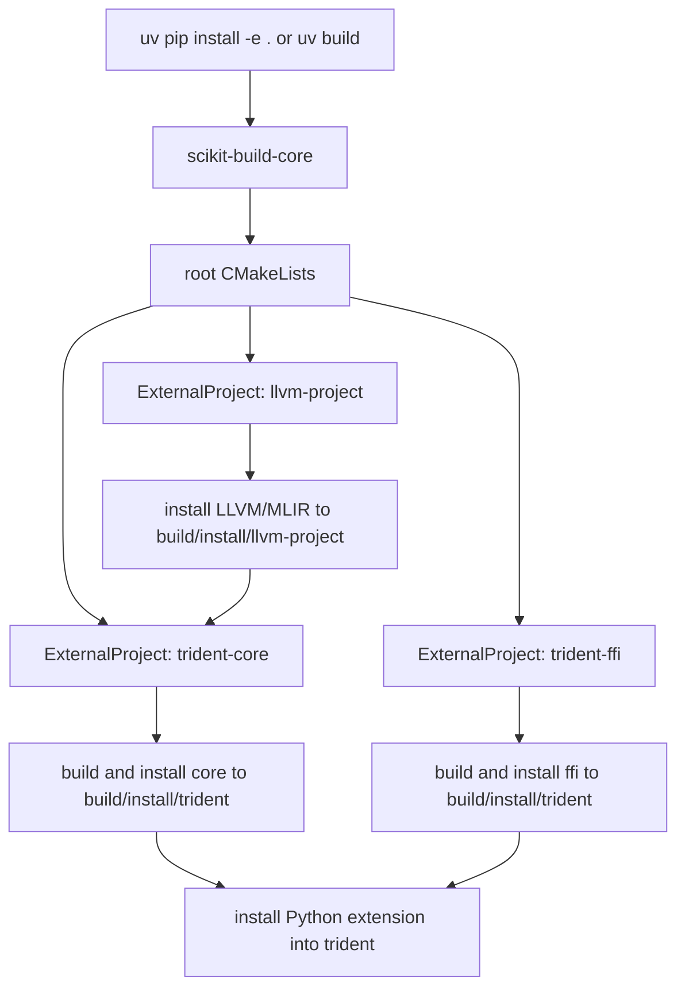
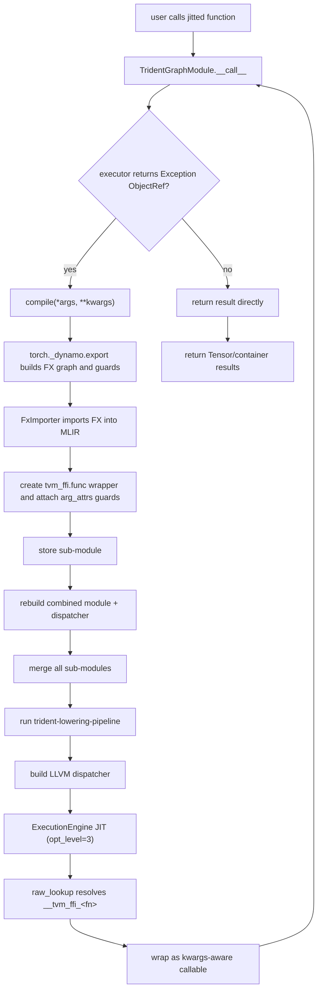

# Trident Architecture

This document describes the core workflows in the current repository:

- Build workflow: how the Python packaging entry points trigger CMake and external dependency builds.
- Runtime workflow: how a Python function is transformed into MLIR/LLVM and then executed via JIT.

## High-Level Components

- Top-level CMake project
  - Dependencies are orchestrated via `ExternalProject` in the root `CMakeLists.txt`:
    - `llvm-project` (with MLIR + Python bindings enabled)
    - `trident-core` (the core C++/MLIR implementation in this repo)
    - `trident-ffi` (the FFI runtime layer — Exception ObjectRef and type stubs)
- core
  - Implements and exports Dialects/Passes/Runtime/Python bindings.
  - Depends on torch-mlir, MLIR, LLVM, CUDAToolkit, Torch, and tvm_ffi.
- ffi
  - Lightweight C++ shared library (`libTridentFFI.so`) providing FFI-level types.
  - Exports `trident.ffi.Exception` — an `ObjectRef`-based error type for composable error handling.
  - Python stubs auto-generated via `tvm-ffi-stubgen` at build time.
- Python package trident
  - User-facing entry points: `jit` and `compile`.
  - Core backend object: `TridentGraphModule`.
  - Handles graph export/import, guard specialization, compilation, and execution dispatch.

## Build Workflow

Build highlights:

- `pyproject.toml` uses `scikit-build-core` as the build backend.
- Build steps fetch and compile `llvm-project` and `torch-mlir`; first builds can take a long time.
- `wheel.install-dir` is configured as `trident` so Python can import both `trident.core` and `trident.ffi` bindings directly.
- The `ffi` subproject builds `libTridentFFI.so` and auto-generates `_ffi_api.py` stubs via `tvm-ffi-stubgen`.

## Runtime Compilation Workflow

Users typically decorate Python functions with `@trident.jit`. The call path is:

### `compile` vs `jit`

Trident exposes two entry points (`python/trident/compile.py`):

- **`trident.compile(fn)`** — Returns a factory function. Each call creates a fresh
  `TridentGraphModule`, compiles it once with the given arguments, and returns the
  resulting callable. No recompilation on guard mismatch — the returned function
  always uses the original specialization.

- **`trident.jit(fn)`** — Returns a `TridentGraphModule` directly. Supports
  incremental specialization: when the dispatcher returns an `Exception` ObjectRef
  (indicating all specializations failed guard checks), the module automatically
  recompiles for new input shapes/dtypes/devices (up to `max_compiles` times,
  default 2). Supports both positional and keyword arguments via
  `tvm_ffi.utils.kwargs_wrapper`.

Use `compile` for one-shot compilation when inputs are known and stable.
Use `jit` when inputs may vary across calls.

## Specialization And Guard Strategy

Each `compile(*args, **kwargs)` produces a new sub-module with these properties:

- The `main` function symbol is indexed to avoid collisions (for example `main_0`, `main_1`).
- The exported `tvm_ffi.func` is also indexed (for example `<fn>_0`, `<fn>_1`).
- Guards exported by Dynamo are converted to MLIR attributes and attached to `tvm_ffi.func` argument attributes.
- `torch._dynamo.reset()` is called after each FX import to release tracing resources.

When runtime inputs change and guards no longer match:

- A sub-function returns a `trident.ffi.Exception` ObjectRef (not a Python exception) via the FFI layer.
- The outer dispatcher inspects the return type — if it is an `Exception`, it tries the next specialization.
- If all specializations fail, the dispatcher returns an `Exception` to the Python caller.
- `TridentGraphModule.__call__` detects the `Exception` ObjectRef and triggers recompilation.

The `max_compiles` parameter (default 2) controls the recompilation limit per
`TridentGraphModule`. Each new specialization appends a sub-module; the
dispatcher tries them in creation order. The following guard types (implemented
in `python/trident/guards/`) translate Dynamo's export guards into MLIR argument
attributes on `tvm_ffi.func`:

| Guard Class | Purpose |
|---|---|
| `ConstantGuard` | Checks tensor values against expected constants |
| `CUDADeviceGuard` | Ensures tensor is on the expected CUDA device |
| `DimensionGuard` | Validates tensor dimensionality |
| `DTypeGuard` | Checks tensor element type |
| `SizeGuard` | Validates specific dimension sizes |
| `StorageOffsetGuard` | Checks tensor storage offset |
| `StrideGuard` | Validates tensor strides |
| `TensorTypeGuard` | Ensures value is a tensor |
| `Guards` | Collection that aggregates individual guards |

## FX Import And Triton Kernel Handling

Triton higher-order ops (HOPs) like `triton_kernel_wrapper_mutation` are not natively
supported by torch-mlir's `FxImporter`. Trident uses a scoped monkey-patch approach
in `python/trident/patch.py` to inject this support at import time:

- `patch_graph_node_importer_for_triton_hop()` temporarily adds
  `_import_hop_triton_kernel_wrapper_mutation` and helper methods into
  `GraphNodeImporter` before constructing `FxImporter`.
- `unpatch_graph_node_importer_for_triton_hop()` restores the original class
  state in a `try/finally` block, avoiding persistent global side effects.
- The patched import retrieves compiled kernels and runtime parameters from
  Triton JIT/Autotune results, sets `"gpu.container_module"` on the top-level
  module, materializes each kernel's cubin into a `gpu.binary` op, and emits
  `torchext.TridentKernelLaunchOp` referencing the `gpu.binary` symbol.
- For autotune paths, computes/selects launch grids based on `best_config`.

This integrates Triton kernel launches into the MLIR workflow without modifying
torch-mlir source.

## ATen Operator Dispatch (atengen)

Trident uses an auto-generated wrapper layer for ATen operator dispatch via TVM FFI:

1. **Build-time codegen** (`core/lib/Runtime/python/atengen.py`):
   - Queries all registered ATen operator schemas via `torch._C._jit_get_all_schemas()`.
   - Generates `aten.gen.cc` from the Jinja2 template `aten.cc.j2`.
   - Each wrapper registers a TVM FFI global function named `trident.aten.<op>.<overload>`
     and internally uses `c10::Dispatcher::findSchemaOrThrow()` + `callBoxed()`.

2. **MLIR lowering** (`Aten.cc` -> `ConvertAtenDispatcherOp`):
   - Matches all `torch.aten.*` ops generically — no per-op C++ code needed.
   - Rewrites the op name from `torch.aten.X.Y` to `trident.aten.X.Y`.
   - Calls the corresponding TVM FFI global function via `callTVMFFIGlobalFunction()`.

3. **Runtime dispatch** (`Function.h` / `Value.h`):
   - Bidirectional conversion between `TVMFFIAny` and `c10::IValue` via type-driven
     `buildValue<T>()` / `resolveValue<T>()`.
   - Pushes IValues onto a `torch::jit::Stack`, calls `callBoxed()`, and pops results.

This design decouples the MLIR lowering layer from `c10::Dispatcher` — the lowering
only needs to know the `trident.aten.*` FFI symbol name, while the runtime wrapper
handles all PyTorch type-system interaction.

### Special Lowering: `torch.vtensor.literal`

The `torch.vtensor.literal` op (produced during FX import for constant tensors)
bypasses the generic `trident.aten.*` dispatch with a dedicated lowering in
`core/lib/Conversion/TorchToLLVM/Literal.cc`:

- **Splat path**: When all elements are identical, emits `aoti_torch_aten_full`
  for efficient compile-time constant creation.
- **Non-splat path**: Stages data on CPU and copies to device via
  `aoti_torch_copy_`.

## TorchExt Dialect

The `torchext` dialect bridges Torch semantics with MLIR-native types and GPU kernel
launches. Its lowering is split across two passes in `trident-lowering-pipeline`:

| Op | Lowered By | Purpose |
|---|---|---|
| `torchext.cast` | `ConvertTorchExtToGPU` | Converts `!torch.float` / `!torch.int` scalars to native MLIR types (f32/f64/i32/i64) for typed scalar passing to Triton kernels. Implements `CastOpInterface` for standard MLIR cast semantics. |
| `torchext.trident_kernel_launch` | `ConvertTorchExtToGPU` | Launches Triton kernels with explicit grid/block dimensions (I64); unpacks tensor/scalar args from TVMFFIAny into kernel parameters and emits `gpu.launch_func`. Uses TVMFFI stream API for CUDA stream management. |
| `torchext.ObjectIncRef` | `ConvertTorchExtToLLVM` | Increments Torch object reference count via `TVMFFIObjectIncRef(handle)` |
| `torchext.ObjectDecRef` | `ConvertTorchExtToLLVM` | Decrements Torch object reference count via `TVMFFIObjectDecRef(handle)` |

Reference counting ops are automatically inserted by the `RAAI` pass (Reference-count
Auto-Insertion) at the start of the pipeline, which scans each single-block region
and adds `IncRef`/`DecRef` pairs around Torch object uses. The RAAI pass supports
`TupleType` and `OptionalType` values in addition to individual Torch objects.

The `EliminateRefCounter` pass runs immediately after `RAAI` and eliminates
balanced `IncRef`/`DecRef` pairs on the same SSA value within a single block.
For each `torchext.ObjectIncRef`, it scans forward for the nearest unmatched
`torchext.ObjectDecRef` on the same value and erases both operations. Matching
never crosses a block boundary, and a `DecRef` that precedes an `IncRef` is
not eliminated. This cleanup reduces unnecessary reference count traffic before
lowering to LLVM.

CUDA leak checks are integrated into examples to verify correctness.

## LLVM Dispatcher Semantics

After lowering to LLVM, `TridentGraphModule` generates one unified entry point:

- ABI signature: `i32 (ptr, ptr, i32, ptr)`
- Calls `__tvm_ffi_<fn>_<i>` in order
- Uses `TVMFFIErrorMoveFromRaised` / `TVMFFIErrorSetRaised` to read and restore raised errors
- Guard failure is signaled by returning a `trident.ffi.Exception` ObjectRef (not by setting an error code)
- If the return value is a normal result (not an Exception), the dispatcher returns immediately
- If the return value is an Exception, the dispatcher continues to the next specialization
- If all specializations fail, the dispatcher returns the Exception to the Python caller

This provides runtime dispatch across multiple specializations under one stable symbol name.

## C API Layer (`core/include/trident-c`)

The `core/include/trident-c/core/` directory provides a C API bridge
between the C++ MLIR implementation and the Python nanobind layer:

- **`Registration.h`** — Exports `tridentCoreRegisterAllDialects()` and
  `tridentCoreRegisterAllPasses()`, called from the Python registration
  module during `register_all_dialects()` / `register_all_passes()`.

- **`Dialects.h`** — Declares C API registration helpers for the `TorchExt`
  and `TVMFFI` dialects, allowing Python to discover and use these custom
  dialects via `trident.core.dialects`.

This layer ensures the Python package can initialize all custom dialects and
passes without directly linking against C++ MLIR internals.

## FFI Subproject (`ffi/`)

The `ffi/` directory is a separate CMake subproject that builds a lightweight shared
library (`libTridentFFI.so`) providing FFI-level types for composable error handling:

- **`include/trident/ffi/Exception.h`** — Declares `ExceptionObj` (heap-allocated,
  ref-counted) and `Exception` (ObjectRef handle). Each Exception carries a `kind_`
  string (e.g., `"GuardMatchException"`) for error classification.

- **`lib/Exception.cc`** — Implements the Exception type and registers it with
  TVM FFI via `TVM_FFI_STATIC_INIT_BLOCK`. Also exports `trident.ffi.Exception`
  global constructor and `trident.ffi.GetExceptionIndex` for runtime type
  resolution.

- **`python/`** — Contains `_ffi_api.py` with `tvm-ffi-stubgen` directive blocks.
  At build time, `tvm-ffi-stubgen` inspects `libTridentFFI.so` and fills in the
  FFI bindings, which are then installed as `trident/ffi/` in the Python package.

This separation keeps the FFI runtime layer independent of MLIR/LLVM, enabling
lighter build times for the FFI library and cleaner dependency boundaries.

## End-to-End Execution Summary

1. The first call to a Python function triggers compilation.
2. The FX graph is imported into MLIR and wrapped as a tvm_ffi callable.
3. All existing specializations are merged and lowered to LLVM.
4. A dispatcher is generated and JIT-compiled by `ExecutionEngine`.
5. Later calls reuse existing specializations first; guard misses trigger incremental compilation.

This design balances:

- Incremental specialization for dynamic input shapes.
- A unified TVM FFI calling interface.
- A composable compilation path from MLIR pipelines to LLVM.
