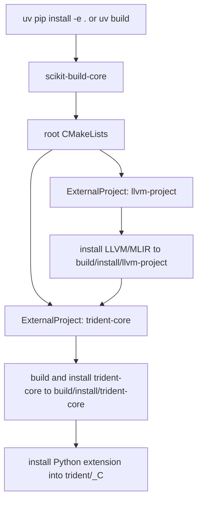
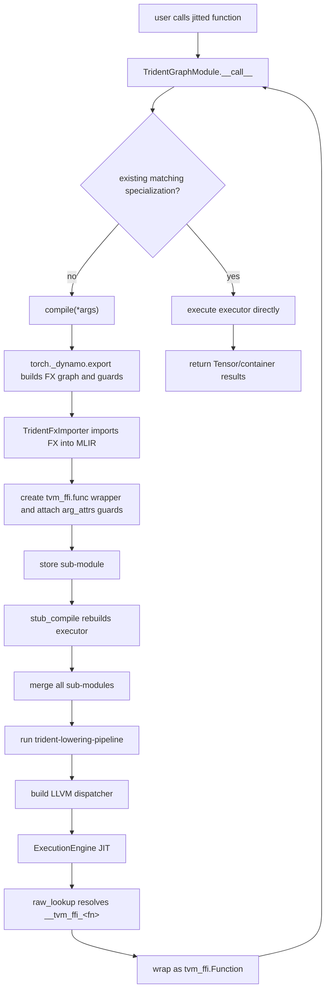

# Trident Architecture

This document describes the core workflows in the current repository:

- Build workflow: how the Python packaging entry points trigger CMake and external dependency builds.
- Runtime workflow: how a Python function is transformed into MLIR/LLVM and then executed via JIT.

## 1. High-Level Components

- Top-level CMake project
  - Dependencies are orchestrated via `ExternalProject` in the root `CMakeLists.txt`:
    - `llvm-project` (with MLIR + Python bindings enabled)
    - `trident-core` (the core C++/MLIR implementation in this repo)
- trident-core
  - Implements and exports Dialects/Passes/Runtime/Python bindings.
  - Depends on torch-mlir, MLIR, LLVM, CUDAToolkit, Torch, and tvm_ffi.
- Python package trident
  - User-facing entry points: `jit` and `compile`.
  - Core backend object: `TridentGraphModule`.
  - Handles graph export/import, guard specialization, compilation, and execution dispatch.

## 2. Build Workflow

Build highlights:

- `pyproject.toml` uses `scikit-build-core` as the build backend.
- Build steps fetch and compile `llvm-project` and `torch-mlir`; first builds can take a long time.
- `wheel.install-dir` is configured as `trident/_C`, so Python can import the C++/MLIR bindings directly.

## 3. Runtime Compilation Workflow

Users typically decorate Python functions with `@trident.jit`. The call path is:

## 4. Specialization And Guard Strategy

Each `compile(*args)` produces a new sub-module with these properties:

- The `main` function symbol is indexed to avoid collisions (for example `main_0`, `main_1`).
- The exported `tvm_ffi.func` is also indexed (for example `<fn>_0`, `<fn>_1`).
- Guards exported by Dynamo are converted to MLIR attributes and attached to `tvm_ffi.func` argument attributes.

When runtime inputs change and guards no longer match:

- A sub-function throws `GuardMatchException` (registered as a tvm_ffi error on the Python side).
- The outer dispatcher checks the error kind and tries the next specialization.
- If none match, it returns a failure code and triggers upper-layer recompilation or failure.

## 5. FX Import And Triton Kernel Handling

Triton higher-order ops (HOPs) like `triton_kernel_wrapper_mutation` are not natively
supported by torch-mlir's `FxImporter`. Trident uses a scoped monkey-patch approach
in `python/trident/patch.py` to inject this support at import time:

- `patch_graph_node_importer_for_triton_hop()` temporarily adds
  `_import_hop_triton_kernel_wrapper_mutation` and helper methods into
  `GraphNodeImporter` before constructing `FxImporter`.
- `unpatch_graph_node_importer_for_triton_hop()` restores the original class
  state in a `try/finally` block, avoiding persistent global side effects.
- The patched import retrieves compiled kernels and runtime parameters from
  Triton JIT/Autotune results, materializes cubin into `gpu.binary` (GPU object)
  attached to the module, and emits `torchext.TridentKernelLaunchOp`.
- For autotune paths, computes/selects launch grids based on `best_config`.

This integrates Triton kernel launches into the MLIR workflow without modifying
torch-mlir source.

## 6. ATen Operator Dispatch (atengen)

Trident uses an auto-generated wrapper layer for ATen operator dispatch via TVM FFI:

1. **Build-time codegen** (`trident-core/lib/Runtime/python/atengen.py`):
   - Queries all registered ATen operator schemas via `torch._C._jit_get_all_schemas()`.
   - Generates `aten.gen.cc` from the Jinja2 template `aten.cc.j2`.
   - Each wrapper registers a TVM FFI global function named `trident.aten.<op>.<overload>`
     and internally uses `c10::Dispatcher::findSchemaOrThrow()` + `callBoxed()`.

2. **MLIR lowering** (`Aten.cc` → `ConvertAtenDispatcherOp`):
   - Matches all `torch.aten.*` ops generically — no per-op C++ code needed.
   - Rewrites the op name from `torch.aten.X.Y` to `trident.aten.X.Y`.
   - Calls the corresponding TVM FFI global function via `callTVMFFIGlobalFunction()`.

3. **Runtime dispatch** (`Function.h` / `Value.h`):
   - Bidirectional conversion between `TVMFFIAny` and `c10::IValue` via type-driven
     `buildValue<T>()` / `resolveValue<T>()`.
   - Pushes IValues onto a `torch::jit::Stack`, calls `callBoxed()`, and pops results.

This design decouples the MLIR lowering layer from `c10::Dispatcher` — the lowering
only needs to know the `trident.aten.*` FFI symbol name, while the runtime wrapper
handles all PyTorch type-system interaction.

## 7. TorchExt Dialect

The `torchext` dialect bridges Torch semantics with MLIR-native types and GPU kernel
launches. Its lowering is split across two passes in `trident-lowering-pipeline`:

| Op | Lowered By | Purpose |
|---|---|---|
| `torchext.cast` | `ConvertTorchExtToGPU` | Converts `!torch.float` / `!torch.int` scalars to native MLIR types (f32/f64/i32/i64) for typed scalar passing to Triton kernels |
| `torchext.trident_kernel_launch` | `ConvertTorchExtToGPU` | Launches Triton kernels with explicit grid/block dimensions; unpacks tensor/scalar args from TVMFFIAny into kernel parameters and emits `gpu.launch_func` |
| `torchext.ObjectIncRef` | `ConvertTorchExtToLLVM` | Increments Torch object reference count via `TVMFFIObjectIncRef(handle)` |
| `torchext.ObjectDecRef` | `ConvertTorchExtToLLVM` | Decrements Torch object reference count via `TVMFFIObjectDecRef(handle)` |

Reference counting ops are automatically inserted by the `RAAI` pass (Reference-count
Auto-Insertion) at the start of the pipeline, which scans each single-block region
and adds `IncRef`/`DecRef` pairs around Torch object uses.

## 8. LLVM Dispatcher Semantics

After lowering to LLVM, `TridentGraphModule` generates one unified entry point:

- ABI signature: `i32 (ptr, ptr, i32, ptr)`
- Calls `__tvm_ffi_<fn>_<i>` in order
- Uses `TVMFFIErrorMoveFromRaised` / `TVMFFIErrorSetRaised` to read and restore raised errors
- If error kind is `GuardMatchException`, it continues to the next branch
- If return value is success or error is not a guard miss, it returns immediately

This provides runtime dispatch across multiple specializations under one stable symbol name.

## 9. End-to-End Execution Summary

1. The first call to a Python function triggers compilation.
2. The FX graph is imported into MLIR and wrapped as a tvm_ffi callable.
3. All existing specializations are merged and lowered to LLVM.
4. A dispatcher is generated and JIT-compiled by `ExecutionEngine`.
5. Later calls reuse existing specializations first; guard misses trigger incremental compilation.

This design balances:

- Incremental specialization for dynamic input shapes.
- A unified TVM FFI calling interface.
- A composable compilation path from MLIR pipelines to LLVM.
