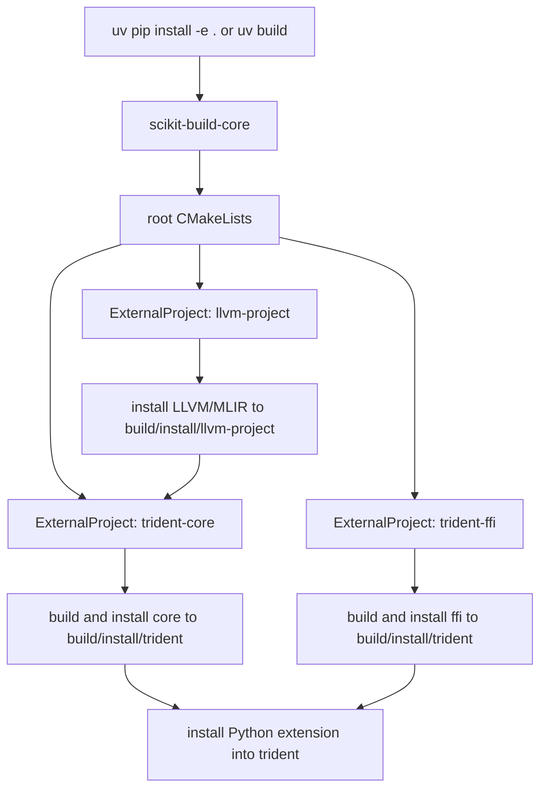
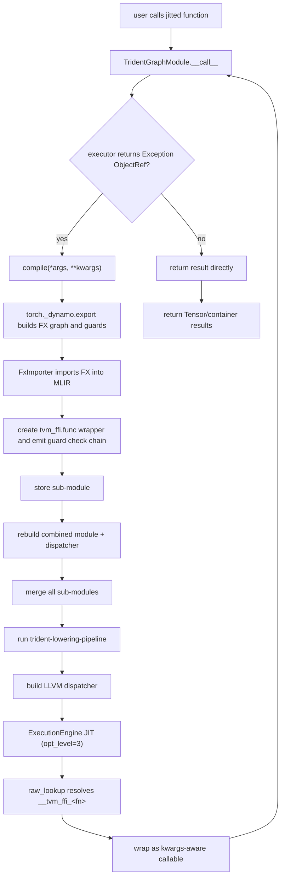

# Trident Architecture

This document describes the core workflows in the current repository:

- Build workflow: how the Python packaging entry points trigger CMake and external dependency builds.
- Runtime workflow: how a Python function is transformed into MLIR/LLVM and then executed via JIT.

## Pattern Rewriting Architecture

Trident uses MLIR's generic DAG-to-DAG rewrite infrastructure for local IR
transformations. Pattern definitions are split by the kind of reasoning they
require:

When constructing a pattern, use the following order of preference:

1. DRR (`.td`) for a fixed, local DAG rewrite whose operands, results, types,
   attributes, and builders can be expressed declaratively.
2. PDLL (`.pdll`) when the match needs richer structural constraints, named
   operations or values, or a small multi-operation rewrite that is awkward in
   DRR.
3. C++ only when the rewrite cannot be represented safely or clearly by either
   declarative form.

DRR and PDLL can be used in a conversion pass for type-independent local
rewrites, but they do not receive conversion-specific remapped operands.
C++ `ConversionPattern` implementations are required when a rewrite depends
on `OpAdaptor`, `TypeConverter`, materializations, legality, region signature
conversion, or other conversion state.

C++ `RewritePattern` implementations also handle region movement, block
creation, recursive cloning, or other imperative construction that is not
appropriate for a declarative pattern.

Dedicated analyses remain responsible for cross-region ownership, guards, ABI
layout, and other global data-flow concerns.

DRR sources are compiled at build time with MLIR TableGen, while PDLL sources
are compiled with the repository's pinned `mlir-pdll` tool. Both produce
headers under the build directory; generated files are never edited or
committed. MLIR's `add_mlir_pdll_library` CMake helper should be used for PDLL
generation instead of duplicating the `mlir-pdll` custom command. This keeps
declarative matchers close to the rewrites they describe while preserving C++
for control-flow and runtime-sensitive lowering.

The current declarative rewrite examples include the DRR definition for
`torch.prim.If.yield -> scf.yield` and `GeneralizeAtenOps.pdll`, which
expresses the fixed scalar and tensor-metadata ATen conversions. The generic
ATen operation wrapper in `GeneralizeAtenOps.cc` remains in C++ because it
must inspect dynamic operation names, copy arbitrary attributes, and reject
region-bearing operations. The surrounding `torch.prim.If` rewrite also
remains in C++ because it must inline regions and manage the replacement block.

## High-Level Components

- Top-level CMake project
  - Dependencies are orchestrated via `ExternalProject` in the root `CMakeLists.txt`:
    - `llvm-project` (with MLIR + Python bindings enabled)
    - `trident-core` (the core C++/MLIR implementation in this repo)
    - `trident-ffi` (the FFI runtime layer — Exception ObjectRef and type stubs)
- core
  - Implements and exports Dialects/Passes/Runtime/Python bindings.
  - Depends on torch-mlir, MLIR, LLVM, CUDAToolkit, Torch, and tvm_ffi.
- ffi
  - Lightweight C++ shared library (`libTridentFFI.so`) providing FFI-level types.
  - Exports `trident.ffi.Exception` — an `ObjectRef`-based error type for composable error handling.
  - Python stubs auto-generated via `tvm-ffi-stubgen` at build time.
- Python package trident
  - User-facing entry points: `jit` and `compile`.
  - Core backend object: `TridentGraphModule`.
  - Handles graph export/import, guard specialization, compilation, and execution dispatch.

## Build Workflow

```mermaid
flowchart TD
  A[uv pip install -e . or uv build] --> B[scikit-build-core]
  B --> C[root CMakeLists]
  C --> D[ExternalProject: llvm-project]
  C --> E[ExternalProject: trident-core]
  C --> F[ExternalProject: trident-ffi]
  D --> G[install LLVM/MLIR to build/install/llvm-project]
  G --> E
  E --> H[build and install core to build/install/trident]
  F --> I[build and install ffi to build/install/trident]
  H --> J[install Python extension into trident]
  I --> J
```

Build highlights:

- `pyproject.toml` uses `scikit-build-core` as the build backend.
- Build steps fetch and compile `llvm-project` and `torch-mlir`; first builds can take a long time.
- `wheel.install-dir` is configured as `trident` so Python can import both `trident.core` and `trident.ffi` bindings directly.
- The `ffi` subproject builds `libTridentFFI.so` and auto-generates `_ffi_api.py` stubs via `tvm-ffi-stubgen`.

## Runtime Compilation Workflow

Users typically decorate Python functions with `@trident.jit`. The call path is:

```mermaid
flowchart TD
  A["user calls jitted function"] --> B["TridentGraphModule.__call__"]
  B --> C{"executor returns Exception ObjectRef?"}
  C -- "no" --> D["return result directly"]
  C -- "yes" --> E["compile(*args, **kwargs)"]
  E --> F["torch._dynamo.export builds FX graph and guards"]
  F --> G["FxImporter imports FX into MLIR"]
  G --> H["create tvm_ffi.func wrapper and emit guard check chain"]
  H --> I["store sub-module"]
  I --> J["rebuild combined module + dispatcher"]
  J --> K["merge all sub-modules"]
  K --> L["run trident-lowering-pipeline"]
  L --> M["build LLVM dispatcher"]
  M --> N["ExecutionEngine JIT (opt_level=3)"]
  N --> O["raw_lookup resolves __tvm_ffi_&lt;fn&gt;"]
  O --> P["wrap as kwargs-aware callable"]
  P --> B
  D --> Q["return Tensor/container results"]
```

### `compile` vs `jit`

Trident exposes two entry points (`python/trident/compile.py`):

- **`trident.compile(fn)`** — Returns a factory function. Each call creates a fresh
  `TridentGraphModule`, compiles it once with the given arguments, and returns the
  resulting callable. No recompilation on guard mismatch — the returned function
  always uses the original specialization.

- **`trident.jit(fn)`** — Returns a `TridentGraphModule` directly. Dynamic shape
  tracing is enabled by default and can be disabled with
  `@trident.jit(dynamic=False)`. Supports incremental specialization:
  when the dispatcher returns an `Exception` ObjectRef (indicating all
  specializations failed guard checks), the module automatically recompiles for
  new input shapes/dtypes/devices (up to `max_compiles` times, default 2).
  Supports both positional and keyword arguments via
  `tvm_ffi.utils.kwargs_wrapper`.

Use `compile` for one-shot compilation when inputs are known and stable.
Use `jit` when inputs may vary across calls.

## Specialization And Guard Strategy

Each `compile(*args, **kwargs)` produces a new sub-module with these properties:

- The `main` function symbol is indexed to avoid collisions (for example `main_0`, `main_1`).
- The exported `tvm_ffi.func` is also indexed (for example `<fn>_0`, `<fn>_1`).
- Guards exported by Dynamo are converted to semantic check IR in the `tvm_ffi.func` body.
- `torch._dynamo.reset()` is called after each FX import to release tracing resources.

### `tvm_ffi.func` input reconstruction

The `tvm_ffi.func` signature mirrors the *Python* function signature (one SSA
argument per parameter; container parameters typed `!tvm_ffi.array`). This
keeps `num_args` (as seen by the Python kwargs wrapper) equal to the number of
SSA arguments, so tuple/list parameters do not overrun the FFI argument array.

- `input.py::InputTableBuilder` combines `ExportedProgram.graph_signature`
  with `ExportedProgram.call_spec.in_spec`. It records static
  `InputNodeBuilder` recipes, exported input names, and wrapper types without
  retaining IR values.
- A builder binds the operands of each IR region to a fresh `InputTable` whose
  nodes own their child trees and lazy region-local value builders. Guards
  resolve sources with `table[path]`; the table recursively emits one
  `tvm_ffi.array.get_item` for each container level on that path and does not
  cache materialized values.
- The guarded success region uses its own table to recursively flatten all
  exported inputs in graph-signature order. The backend pairs those values
  with the input specs and selects the operands consumed by `main_{i}`. Values
  are not cached across regions, so every extracted SSA value is defined in
  the region where it is consumed.
- `ffi.ArrayGetItem` returns a *borrowed* reference (the container argument is
  kept alive by the FFI call context for the duration of the call), so no
  ref-counting is emitted for extracted elements.
- dict parameters are currently rejected during signature reconstruction by
  an assertion (runtime `ffi.MapGetItem` exists; lowering support is future
  work), and
  keyword arguments must be passed in signature order (the flat tree order must
  match the signature parameter order).
- `ExportedProgram.call_spec.in_spec` is required. Export paths that do not
  provide it are rejected during signature reconstruction.

When runtime inputs change and guards no longer match:

- A sub-function returns a `trident.ffi.Exception` ObjectRef (not a Python exception) via the FFI layer.
- The outer dispatcher inspects the return type — if it is an `Exception`, it tries the next specialization.
- If all specializations fail, the dispatcher returns an `Exception` to the Python caller.
- `TridentGraphModule.__call__` detects the `Exception` ObjectRef and triggers recompilation.

The `max_compiles` parameter (default 2) controls the recompilation limit per
`TridentGraphModule`. Each new specialization appends a sub-module; the
dispatcher tries them in creation order. Guard handling is split into two
layers under `python/trident/guards`: `handlers/` selects behavior from Dynamo's
`Guard.create_fn_name()`, while `codes/` parses one expression from the Guard's
CodeList. Each Handler inherits from a common base class, registers itself when
the subclass is defined, and declares a tuple of allowed Code classes. Every
CodeList expression must match exactly one of those classes; zero or multiple
matches are ignored instead of relying on parser order.

Ordinary local sources are parsed from `Guard.name` with Python's AST into a
root argument plus integer-index path. Code classes use source-aware regular
expressions except for `ASTCode`, which uses an AST because shape expressions
can combine multiple sources, arithmetic, and comparisons. Each parsed Code
object produces a delayed builder carrying its deduplication key, execution
phase, and structural depth. The collection orders the builders and invokes
them in `arithext.and_then` regions so they short-circuit before unsafe tensor
or container metadata access:

| Dynamo create function | Selected Code classes |
|---|---|
| `TYPE_MATCH` | Type-id validation; runtime type checking comes from the wrapper signature |
| `TENSOR_MATCH` | Type-id, dtype, device, rank, requires-grad, and Dynamo-attribute Code classes |
| `CONSTANT_MATCH` | Scalar constant Code class |
| `SEQUENCE_LENGTH` | Type-id and runtime sequence-length Code classes |
| `SHAPE_ENV` | AST shape-expression Code class |

Integer-indexed container sources such as `L['s'][0]` are resolved through the
same pytree structure used to reconstruct the wrapper signature. Unsupported
create functions or expressions are represented as absent guards and do not
emit check IR. Structural checks run from shallowest to deepest; value and
shape checks follow. `SHAPE_ENV`
is the sole builder that discovers sources from its expressions because its
Dynamo `Guard.name` is empty and one guard can reference multiple tensors.
Process-global ambient guards are registered as no-op Guard subclasses, while
export-resolved global/default capture sources are filtered before IR emission.

## FX Import And Triton Kernel Handling

Triton higher-order ops (HOPs) like `triton_kernel_wrapper_mutation` are not natively
supported by torch-mlir's `FxImporter`. Trident uses a scoped monkey-patch approach
in `python/trident/patch.py` to inject this support at import time:

- `patch_graph_node_importer_for_triton_hop()` temporarily adds
  `_import_hop_triton_kernel_wrapper_mutation` and helper methods into
  `GraphNodeImporter` before constructing `FxImporter`.
- `unpatch_graph_node_importer_for_triton_hop()` restores the original class
  state in a `try/finally` block, avoiding persistent global side effects.
- The patched import retrieves compiled kernels and runtime parameters from
  Triton JIT/Autotune results, sets `"gpu.container_module"` on the top-level
  module, materializes each kernel's cubin into a `gpu.binary` op, and emits
  `torchext.TridentKernelLaunchOp` referencing the `gpu.binary` symbol.
- For autotune paths, computes/selects launch grids based on `best_config`.

This integrates Triton kernel launches into the MLIR workflow without modifying
torch-mlir source.

## ATen Operator Dispatch (atengen)

Trident uses an auto-generated wrapper layer for ATen operator dispatch via TVM FFI.
The wrappers are built as `libTridentAtenFFI.so` in the `ffi` subproject:

1. **Build-time codegen** (`ffi/lib/aten/atengen.py`):
   - Queries all registered ATen operator schemas via `torch._C._jit_get_all_schemas()`.
   - Generates `aten.gen.cc` from the Jinja2 template `ffi/lib/aten/aten.cc.j2`.
   - Each wrapper registers a TVM FFI global function named `trident.aten.<op>.<overload>`
     and internally uses `c10::Dispatcher::findSchemaOrThrow()` + `callBoxed()`.

2. **MLIR lowering** (`Aten.cc` -> `ConvertAtenDispatcherOp`):
   - Matches all `torch.aten.*` ops generically — no per-op C++ code needed.
   - Rewrites the op name from `torch.aten.X.Y` to `trident.aten.X.Y`.
   - Calls the corresponding TVM FFI global function via `callTVMFFIGlobalFunction()`.

3. **Runtime dispatch** (`Function.h` / `Value.h`):
   - Bidirectional conversion between `TVMFFIAny` and `c10::IValue` via type-driven
     `buildValue<T>()` / `resolveValue<T>()`.
   - Pushes IValues onto a `torch::jit::Stack`, calls `callBoxed()`, and pops results.

This design decouples the MLIR lowering layer from `c10::Dispatcher` — the lowering
only needs to know the `trident.aten.*` FFI symbol name, while the runtime wrapper
handles all PyTorch type-system interaction.

### TVMFFI semantic lowering

Torch values cross the runtime boundary through the `tvm_ffi` dialect.  The
`ConvertTorchToTVMFFI` pass converts scalar, device, tensor, list, and tuple
types to their semantic TVMFFI counterparts (lists and tuples use
`!tvm_ffi.array`), rewrites dispatcher calls to `tvm_ffi.FunctionGetGlobal` /
`tvm_ffi.FunctionCall`, and emits
explicit `tvm_ffi.ObjectIncRef`/`tvm_ffi.ObjectDecRef` operations for manually-managed
objects.  `ConvertTVMFFIToLLVM` then lowers these operations to the TVM FFI
ABI.  LLVM lowering consumes only the semantic TVMFFI representation.

## TorchExt Dialect

The `torchext` dialect bridges Torch semantics with MLIR-native types and GPU kernel
launches. Its lowering is split across two passes in `trident-lowering-pipeline`:

| Op | Lowered By | Purpose |
|---|---|---|
| `torch_c.to_i1`, `torch_c.to_i64`, `torch_c.to_f64` | `ConvertTorchToTVMFFI` | Custom-lowers Torch scalar conversion ops to `tvm_ffi.get` for typed scalar passing to Triton kernels. |
| `torchext.trident_kernel_launch` | `ConvertTorchExtToGPU` | Launches Triton kernels with explicit grid/block dimensions (I64); unpacks tensor/scalar args from TVMFFIAny into kernel parameters and emits `gpu.launch_func`. Uses TVMFFI stream API for CUDA stream management. |

Reference counting for Torch objects (tensors, lists, tuples, optionals)
backed by manually-managed resources is handled inside `ConvertTorchToTVMFFI`.
TVMFFI operations expose owned, borrowed, forwarded, and consumed values
through an ownership interface. After conversion, a region-local ownership
analysis tracks a separate reference-credit balance for every SSA value. It emits
`TVMFFIObjectIncRef` for terminator operands and releases the remaining local
credits with `TVMFFIObjectDecRef`. Escaping increments are emitted before local
decrements so a returned owned object remains live while ownership transfers to
the caller.

## LLVM Dispatcher Semantics

After lowering to LLVM, `TridentGraphModule` generates one unified entry point:

- ABI signature: `i32 (ptr, ptr, i32, ptr)`
- Calls `__tvm_ffi_<fn>_<i>` in order
- Uses `TVMFFIErrorMoveFromRaised` / `TVMFFIErrorSetRaised` to read and restore raised errors
- Guard failure is signaled by returning a `trident.ffi.Exception` ObjectRef (not by setting an error code)
- If the return value is a normal result (not an Exception), the dispatcher returns immediately
- If the return value is an Exception, the dispatcher continues to the next specialization
- If all specializations fail, the dispatcher returns the Exception to the Python caller

This provides runtime dispatch across multiple specializations under one stable symbol name.

## C API Layer (`core/include/trident-c`)

The `core/include/trident-c/core/` directory provides a C API bridge
between the C++ MLIR implementation and the Python nanobind layer:

- **`Registration.h`** — Exports `tridentCoreRegisterAllDialects()` and
  `tridentCoreRegisterAllPasses()`, called from the Python registration
  module during `register_all_dialects()` / `register_all_passes()`.

- **`Dialects.h`** — Declares C API registration helpers for the `TorchExt`
  and `TVMFFI` dialects, allowing Python to discover and use these custom
  dialects via `trident.core.dialects`.

This layer ensures the Python package can initialize all custom dialects and
passes without directly linking against C++ MLIR internals.

## FFI Subproject (`ffi/`)

The `ffi/` directory is a separate CMake subproject that builds a lightweight shared
library (`libTridentFFI.so`) providing FFI-level types for composable error handling:

- **`include/trident/ffi/Exception.h`** — Declares `ExceptionObj` (heap-allocated,
  ref-counted) and `Exception` (ObjectRef handle). Each Exception carries a `kind_`
  string (e.g., `"GuardMatchException"`) for error classification.

- **`lib/Exception.cc`** — Implements the Exception type and registers it with
  TVM FFI via `TVM_FFI_STATIC_INIT_BLOCK`. Also exports `trident.ffi.Exception`
  global constructor and `trident.ffi.GetExceptionIndex` for runtime type
  resolution.

- **`python/`** — Contains `_ffi_api.py` with `tvm-ffi-stubgen` directive blocks.
  At build time, `tvm-ffi-stubgen` inspects `libTridentFFI.so` and fills in the
  FFI bindings, which are then installed as `trident/ffi/` in the Python package.

This separation keeps the FFI runtime layer independent of MLIR/LLVM, enabling
lighter build times for the FFI library and cleaner dependency boundaries.

## End-to-End Execution Summary

1. The first call to a Python function triggers compilation.
2. The FX graph is imported into MLIR and wrapped as a tvm_ffi callable.
3. All existing specializations are merged and lowered to LLVM.
4. A dispatcher is generated and JIT-compiled by `ExecutionEngine`.
5. Later calls reuse existing specializations first; guard misses trigger incremental compilation.

This design balances:

- Incremental specialization for dynamic input shapes.
- A unified TVM FFI calling interface.
- A composable compilation path from MLIR pipelines to LLVM.
